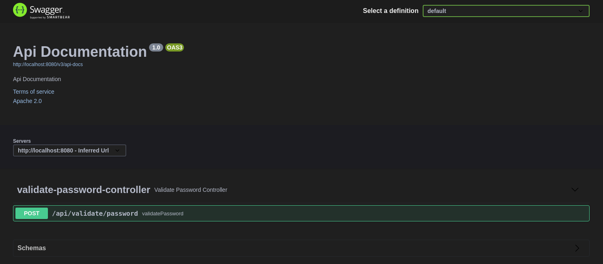

# backend-challenge
Backend Challenges - Validate Password

Swagger


http://localhost:8080/swagger-ui/

# Description: 

This API is use for validade passwords. 
The rules for validation are: 
 - Nine or more characters
 - At least 1 digit 
 - At least 1 lowercase letter
 - At least 1 uppercase letter
 - At least 1 special character
   - Consider the following characters as special: !@#$%^&*()-+
 - Do not have repeated characters within the set

# Stack: 

  Language: Kotlin (v1.4.32)

  Architecture: MVC

  Dependency Manager: Gradle (v6.8.3

  Framework: Spring Boot (v2.5.0-SNAPSHOT)

    Plugins: 
      Spring Actuator
      Undertow
  Swagger (v3) 

  Java JVM: JDK 11

# Run Application:
  Main Class: ValidatorPasswordApiApplication.kt

# Build
  ```./gradlew clean build```

## Build para Execução dos teste Unitários
  ```./gradlew clean build test```
  
## Application Port: 
8080
  
# Endpoints: 
  ### Swagger:
    UI - URL: http://localhost:8080/swagger-ui/
    Code - URL: http://localhost:8080/v2/api-docs
    Method: GET
  ### Health Check
    URL: http://localhost:8080/health
    Method: GET
  ### Validate Password
    URL: 
    Method: POST
    Payload: (json)
      {
        "password": "senha"
      }
    

